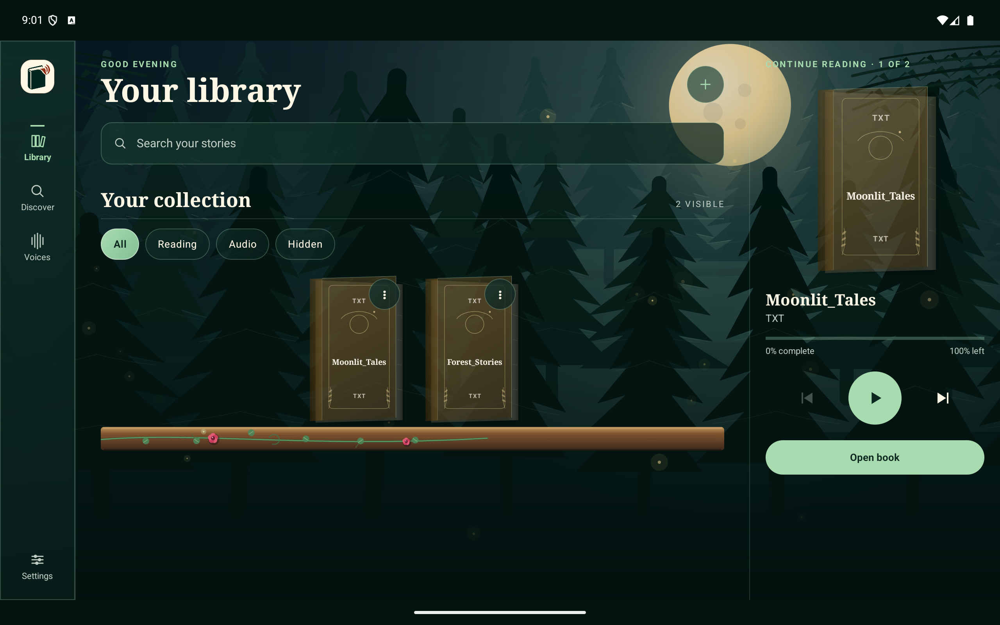
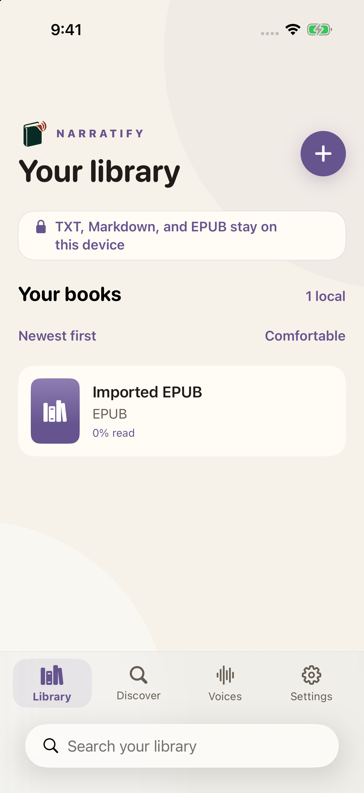
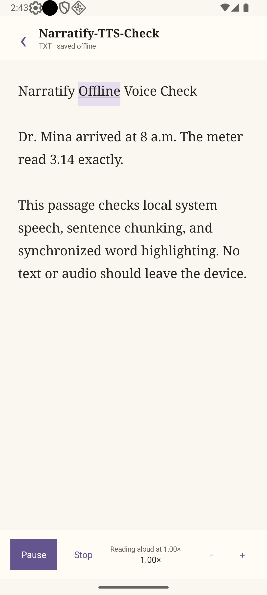
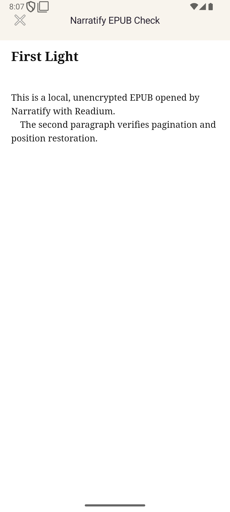
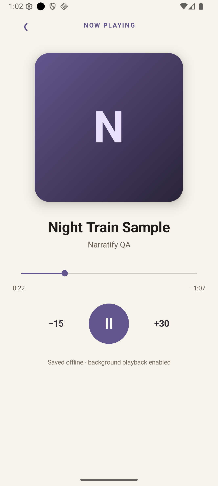

<div align="center">
  
  <h1>Narratify</h1>
  <p><strong>Your books. Your voice. Your pace.</strong></p>
  <p>An offline-first ebook reader and listening companion for Android and iOS.</p>
  <p>
    <a href="https://github.com/all3n2601/Narratify/actions/workflows/verify.yml"></a>
    
    
    
  </p>
  <p><a href="#features">Features</a> · <a href="#screenshots">Screenshots</a> · <a href="#getting-started">Getting started</a> · <a href="#project-structure">Architecture</a> · <a href="#development-status">Roadmap</a></p>
</div>



Narratify brings local reading, read-aloud, and audiobook playback into a native app. Import your own books, pick up where you left off, or search open catalogs for your next read. Imported files live in private app storage, and offline voices let you listen without sending book text to a cloud speech service.

**This is a development project.** Build it from source using the instructions below; there is no published App Store or Google Play release. Android and iOS have different feature coverage, listed explicitly here.

## Features

- **Bring your own library:** import unencrypted EPUB, TXT, and Markdown files, with reading positions saved across app launches.
- **Read and listen:** native Readium EPUB rendering, chapter navigation, offline system text-to-speech, and highlighting as narration progresses.
- **Discover books:** one search across Project Gutenberg, Open Library, Google Books, Internet Archive, and LibriVox. Results are merged and ranked by title and author relevance.
- **Add public EPUBs:** import supported direct Project Gutenberg downloads into your local library; metadata and borrowing results link back to their source.
- **Make reading comfortable:** phone and tablet layouts, library search, and reading preferences.
- **Listen on Android:** play local MP3, M4A, and M4B files in the background, and pair an audiobook with an EPUB through a reviewable chapter mapping.
- **Optional Android neural voices:** downloadable English Kokoro voices run on-device with ONNX Runtime. Packs are staged and checked against pinned sizes and SHA-256 digests before activation; the system voice remains available as a fallback.

### Platform support

| Capability | Android | iOS |
| --- | --- | --- |
| Local EPUB, TXT, and Markdown reading | Available | Available |
| Persistent reading position and chapter outline | Available | Available |
| Open-catalog search and supported EPUB downloads | Available | Available |
| Offline system read-aloud | Available | Available |
| Narration highlighting | Word/source ranges | Spoken passages |
| Downloadable Kokoro neural voices | Available for English | Locked; inference runtime pending |
| Local MP3/M4A/M4B playback | Available | Pending |
| Pair an audiobook with an EPUB and review chapter mapping | Available | Pending |
| Shared alignment algorithms and test fixtures | Implemented in shared module | Native app integration pending |

## Screenshots

These are actual development captures using local test books. They show the iOS library and representative Android reading and listening flows; the app starts with an empty library, and appearance varies by theme and device.

<table>
  <tr>
    <th>iOS library</th>
    <th>Read aloud</th>
    <th>EPUB reading</th>
    <th>Audiobook playback</th>
  </tr>
  <tr>
    <td></td>
    <td></td>
    <td></td>
    <td></td>
  </tr>
</table>

## Getting started

### Prerequisites

| Tool | Needed for |
| --- | --- |
| JDK 17 or later | Gradle and Android/shared builds |
| Android SDK Platform 37.0, Build Tools 36.0.0, and Command-line Tools 23.0+ | Android compilation |
| Android device or emulator running API 26+ | Running the Android app |
| macOS with Xcode and an installed iOS simulator | Building and testing the iOS app |
| [XcodeGen](https://github.com/yonaskolb/XcodeGen) | Regenerating the iOS project from `project.yml` |
| Python 3 | Benchmark contract and alignment fixture checks |

Gradle, Kotlin, and dependency versions are pinned in the repository. Use the checked-in Gradle wrapper instead of a separately installed Gradle.

```sh
git clone https://github.com/all3n2601/Narratify.git
cd Narratify
```

### Android

Open the repository in Android Studio, let Gradle sync, and select the `androidApp` run configuration. For a command-line build, set `ANDROID_HOME` to your Android SDK directory or create an untracked `local.properties` containing `sdk.dir=/path/to/Android/sdk`.

```sh
# Build a development APK.
./gradlew :androidApp:assembleDebug

# Install on a connected device or running emulator.
./gradlew :androidApp:installDebug
adb shell am start -n app.narratify/.MainActivity
```

The APK is written to `androidApp/build/outputs/apk/debug/androidApp-debug.apk`.

### iOS

```sh
cd iosApp
xcodegen generate
open Narratify.xcodeproj
```

Select the **Narratify** scheme and an iPhone or iPad simulator, then run the app. For a simulator build without code signing:

```sh
xcodebuild -project Narratify.xcodeproj -scheme Narratify \
  -sdk iphonesimulator -destination 'generic/platform=iOS Simulator' \
  build CODE_SIGNING_ALLOWED=NO
```

Physical-device builds require your own signing team. The iOS app currently builds independently of the shared Kotlin modules; see the [iOS integration notes](iosApp/README.md) before changing that boundary.

### Try it out

1. Open **Library**, tap **+**, and import an unencrypted EPUB, TXT, or Markdown file. For a quick text-reading check, import a [`reference.txt` fixture](test-fixtures/alignment/cases/clean-narration/reference.txt).
2. Open the book and use the reader's playback controls to start read-aloud. Install an offline system voice in your device settings if needed.
3. Open **Discover**, search by title or author, and use **Add EPUB** on a supported public download.
4. On Android, import an MP3, M4A, or M4B for audiobook playback, or use a book's narration actions to attach a recording and review its chapter mapping.
5. On Android, open **Voices** to install an optional English Kokoro pack. The initial model download is approximately 330 MB; installed voice assets can then be used offline.

Discovery, cover fetching, EPUB downloads, and initial voice-pack installation require internet access. Imported books and installed offline voices remain usable without it.

## Testing

Run Android/shared verification and compile the app:

```sh
./gradlew check :androidApp:assembleDebug
```

On macOS, `check` also runs configured Kotlin/Native simulator tests. To run the native SwiftUI app tests, choose an installed simulator from `xcrun simctl list devices available`, then:

```sh
cd iosApp
xcodebuild -project Narratify.xcodeproj -scheme Narratify \
  -sdk iphonesimulator -destination 'platform=iOS Simulator,name=iPhone 17 Pro' \
  test CODE_SIGNING_ALLOWED=NO
```

From the repository root, verify the Python benchmark tooling and fixtures:

```sh
python3 -m unittest discover -s benchmarks/tts/tests
python3 -m unittest discover -s benchmarks/alignment/tests
python3 benchmarks/tts/validate_corpus.py
python3 benchmarks/alignment/validate_fixture.py
python3 benchmarks/tts/validate_license_inventory.py \
  benchmarks/tts/license-inventory.pending.json --require-approved
```

The [verification workflow](.github/workflows/verify.yml) checks Android/shared contracts, database migrations, the TTS benchmark contract, and alignment fixtures. The manually triggered [neural voice release gate](.github/workflows/neural-voice-release-gate.yml) separately enforces the recorded distribution approval. Benchmark mocks verify the tooling; they do not establish real-device speech quality or thermal performance.

## Project structure

```text
androidApp/            Native Kotlin Android app, Readium, Media3, Kokoro/ONNX
iosApp/               Native SwiftUI app and Readium integration
shared/
  domain/              Locators, outline contracts, alignment and playback models
  data/                SQLDelight schema, search cache, managed files and positions
  playback/            Deterministic playback queue and backend contracts
  text/                Segmentation, normalization and source-preserving token maps
  align/               Anchor-and-fill alignment and EPUB media-overlay generation
benchmarks/            Offline TTS and audiobook-alignment evaluation tooling
test-fixtures/         Media, outline, alignment and multilingual TTS fixtures
docs/                  Design decisions, execution plans and dependency records
assets/brand/          Narratify artwork
```

Android uses shared Kotlin modules directly. iOS currently implements its native reader independently. Alignment code preserves confidence information and avoids claiming word-level synchronization when the transcript evidence only supports a coarser result.

Useful entry points: [Android app](androidApp/src/main/kotlin/app/narratify/MainActivity.kt), [iOS app](iosApp/Sources/NarratifyApp.swift), [shared playback](shared/playback/README.md), [text processing](shared/text/README.md), and [data layer](shared/data/README.md).

## Development status

The repository contains working local reading and narration flows alongside ongoing work. Remaining areas include:

- A reviewed on-device neural inference runtime for iOS.
- Stable shared-framework integration with the native iOS app.
- End-to-end audiobook forced alignment beyond the existing algorithms, fixtures, and Android chapter mapping.
- Physical-device listening, battery, and thermal acceptance across the target device matrix.
- Packaging and distribution for app-store releases.

The detailed engineering history and planned milestones live in the [implementation plan](IMPLEMENTATION_PLAN.md), [neural TTS execution plan](docs/NEURAL_TTS_EXECUTION_PLAN.md), [speech diagnostics guide](docs/tts/SPEECH_DIAGNOSTICS.md), and [alignment benchmarks](benchmarks/alignment/README.md).

## Contributing

Issues and focused pull requests are welcome. Include the platform, device/OS version, file format, and reproduction steps when reporting a problem. For code changes, run the relevant checks above and include screenshots when behavior or layout changes. Keep imported personal books, downloaded models, local SDK paths, signing credentials, and generated build files out of commits.

## Licensing and credits

This repository is publicly viewable, but no project-wide open-source license has been granted. Public visibility alone does not grant permission to redistribute or reuse Narratify's original code or artwork. Third-party components and fixtures retain their own licenses.

Narratify uses [Readium](https://github.com/readium), AndroidX, Media3, SQLDelight, [ONNX Runtime](https://github.com/microsoft/onnxruntime), [Kokoro](https://huggingface.co/hexgrad/Kokoro-82M), and [CMUdict](https://github.com/cmusphinx/cmudict). Exact neural artifacts, recorded approvals, and bundled notices are documented in the [dependency inventory](docs/tts/DEPENDENCY_LICENSE_INVENTORY.md) and [`androidApp/src/main/assets/third_party`](androidApp/src/main/assets/third_party). Catalog content and downloads remain subject to their source's terms and local copyright rules.
